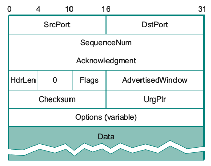

Tugas Jaringan Komputer
Kelompok 13 K01
oleh
Faiz Ghifari Haznitrama  13515010
Yesa Surya               13515088
Dery Rahman Ahaddienata  13515097

BAGIAN I - PETUNJUK PENGGUNAAN
1) 

BAGIAN II - PERTANYAAN DAN JAWABAN
1) Apa yang terjadi jika advertised window yang dikirim bernilai 0? Apa cara untuk menangani hal tersebut?

Pada dasarnya, advertised window digunakan untuk memberitahukan jumlah window tersisa di receiver buffer kepada client sehingga data dalam segmen yang dikirimkan oleh client tidak melebihi jumlah window tersisa. Ketika advertised window bernilai 0, receiver buffer tidak memiliki ruang lagi untuk menampung segmen. Dengan demikian, koneksi TCP akan berhenti untuk sementara waktu yang artinya tidak akan ada lagi segmen yang dikirim oleh client ke server.

Salah satu penyebab permasalahan ini adalah aplikasi yang tidak begitu cepat dalam mengambil segmen yang telah ada di receiver buffer sehingga menyebabkan receiver buffer penuh. Yang dapat dilakukan untuk menangani hal tersebut adalah dengan memperkecil window size. Walaupun transfer data akan menjadi lebih lama karena akan ada lebih banyak waktu untuk menunggu ACK, cara ini memberikan waktu lebih kepada aplikasi untuk mengambil data dari receiver buffer.

2) Sebutkan field data yang terdapat TCP Header serta ukurannya, ilustrasikan, dan jelaskan kegunaan dari masing-masing field data tersebut!

Ilustrasi TCP Header                                      
*Skala diatas ilustrasi merupakan ukuran dari tiap fields*

a. SrcPort dan DstPort digunakan untuk mengidentifikasi port asal dan port tujuan pada koneksi TCP.
b. SequenceNum merupakan urutan data yang dikirimkan pada sebuah segmen.
c. Acknowledgement digunakan untuk memberitahukan kepada host lain bahwa segmen tertentu sudah diterima oleh receiver buffer.
d. AdvertisedWindow digunakan untuk memberitahukan kepada host lain jumlah window yang tersisa pada buffer.
e. Flags digunakan untuk memberikan informasi tertentu kepada host lain. Flags dapat diisi dengan nilai SYN, FIN, RESET, PUSH, URG, atau ACK.
f. Jika flag URG diset, maka UrgPtr merupakan pointer yang menunjukkan data yang tidak urgent.
g. Checksum digunakan untuk mendeteksi data corruption pada koneksi TCP.
h. HdrLen digunakan untuk memberitahu panjang dari TCP header atau mengukur panjang offset dari awal pake hingga awal data. HdrLen disebut juga Offset.
i. Options digunakan untuk menambahkan fitur baru atau 'addon', misalnya Window Scaling.
j. Data merupakan data sebenarnya yang dikirim melalui koneksi TCP.

BAGIAN III - PEMBAGIAN TUGAS
Faiz Ghifari Haznitrama   13515   33%
Membuat struktur data segment dan beberapa API yang digunakan (membuat data menjadi segment, mengubah segment menjadi raw dan sebaliknya)
Yesa Surya                13515   33%
Membuat struktur data receiver buffer dan beberapa API yang digunakan (initializeBuffer, insertSegmentToBuffer, drainBuffer)
Dery Rahman Ahaddienata   13515   34%
Membuat mekanisme sliding window untuk pengiriman segmen
